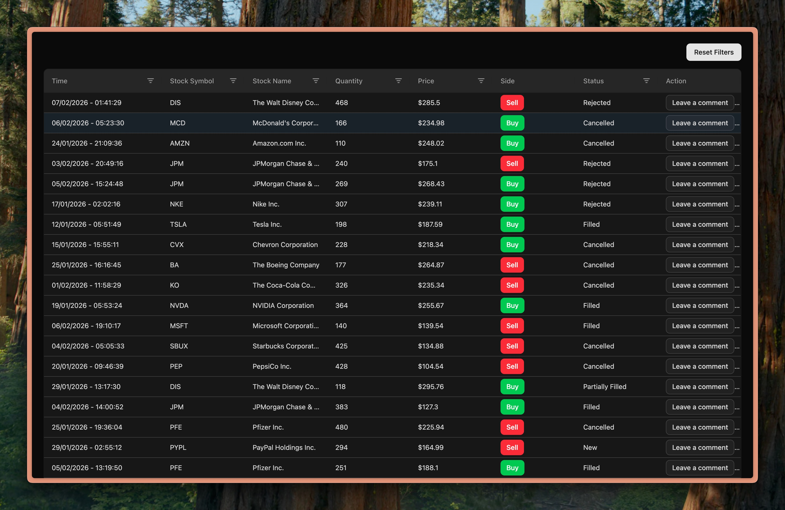

# AG Grid Demo

This is a small project built with **React, TypeScript, and AG Grid** to demonstrate how AG Grid is used to display, explore, and analyse large volumes of data.



## Live Demo

A deployed version of the project is available here:
**https://admirable-phoenix-6b7763.netlify.app/**

## Tech Stack

- Vite
- React
- TypeScript
- AG Grid (Community)
- @faker-js/faker (mock data)
- ShadCN
- TailwindCSS

## Get started

Install npm dependencies

```js
npm install
```

Run development server

```js
npm run dev
```

The application will be served on `http://localhost:5173`.

## Mock Data Strategy

Mock trade data is generated using **@faker-js/faker**. The focus is on **grid behaviour and interaction**, not data sourcing. See `src/data/generateTrades.ts` file.

## Features Demonstrated (Community)

### AG Grid Core Usage

- Column definitions
- Client-side row model (10,000 rows are generated client-side)
- Sorting by column
- Column resizing

### Filtering (Domain-Appropriate)

Each column uses a filter suited to its data:

- Text filters
- Number filters
- Date filter

### Formatting

- Currency formatting for price
- Date formatting for readability

### Custom Cell Renderers & Styling

Custom components rendered for:

- Side (BUY / SELL) column
- Action column

### Custom Styling with TailwindCSS

Default CSS overriden using TailwindCSS
